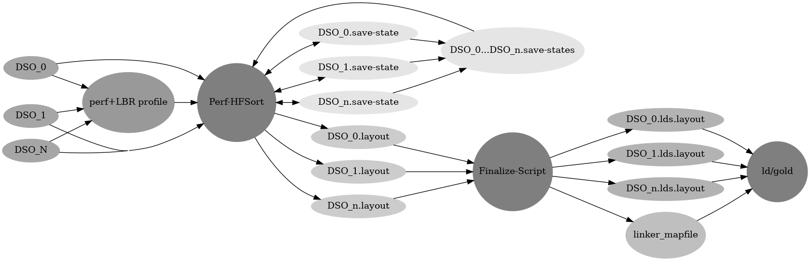

# Thin-Layout-Optimizer

- [1. Introducing Clear Linux' Code-Layout Optimizer](#1-introducing-clearLinux-code-layout-optimizer)
    - [1.1. Code-Layout Optimization](#11-code-layout-optimization)
    - [1.2. BOLT](#12-bolt)
    - [1.3. Propeller](#13-propeller)
- [2. Drawbacks](#2-drawbacks)
    - [2.1. BOLT Drawbacks](#21-bolt-drawbacks)
    - [2.2. Propeller Drawbacks](#22-propeller-drawbacks)
- [3. Our Solution and Thin-Layout-Optimizer](#3-our-solution-and-thin-layout-optimizer)
    - [3.1. Thin-Layout-Optimizer Design](#31-thin-layout-optimizer-design)
    - [3.2. Thin-Layout-Optimizer Section Granularity](#32-thin-layout-optimizer-section-granuality)
    - [3.3. Thin-Layout-Optimizer Profiles](#33-thin-layout-optimizer-profiles)
    - [3.4. Thin-Layout-Optimizer Generating Layouts and Save States](#34-thin-layout-optimizer-generating-layouts-and-save-states)
    - [3.5. Thin-Layout-Optimizer Save States](#35-thin-layout-optimizer-save-states)
    - [3.6. Thin-Layout-Optimizer Layouts](#36-thin-layout-optimizer-layouts)
    - [3.7. Thin-Layout-Optimizer Generating Linker Scripts](#37-thin-layout-optimizer-generating-linker-scripts)
    - [3.8. Thin-Layout-Optimizer Re-Linking](#38-thin-layout-optimizer-re-linking)
- [4. Thin-Layout-Optimizer Full Walkthrough](#4-thin-layout-optimizer-full-walkthrough)
- [5. Performance Comparison](#5-performance-comparison)
- [6. Closing](#6-closing)

# 1. Introducing Clear Linux' Code-Layout Optimizer

This post is to introduce our new code-layout optimizer:
[Thin-Layout-Optimizer](https://github.com/intel/thin-layout-optimizer). Thin-Layout-Optimizer
is meant to be an alternative to existing tools such as
[BOLT](https://arxiv.org/pdf/1807.06735.pdf) and
[Propeller](https://dl.acm.org/doi/pdf/10.1145/3575693.3575727) (more
on them later). The primary design goal of Thin-Layout-Optimizer is to make a
highly usable code-layout optimizer that fits into almost any build
process while maintaining as much of the performance benefits as
possible. The tool is currently in use by
[Clear Linux](https://en.wikipedia.org/wiki/Clear_Linux_OS) and could
be easily used by any other Linux distribution with minimal setup
regardless of the number of or size of the
[DSOs](http://www3.risc.jku.at/education/courses/ws2003/intropar/origin-new/MproCplrDbx_TG/sgi_html/ch03.html)
(executable/shared library) being built.

But first, some background and explanation. After all, what is
code-layout optimization? And if there are existing tools out there,
why do we need a new one?

This post will:

1. Give a brief description code-layout optimizations, their purpose,
   and some of the existing tools.
2. Explain the drawbacks with the current approaches.
3. Introduce our solution, Thin-Layout-Optimizer.
4. Go through a complete example of how to use Thin-Layout-Optimizer by using it
   to speed up [Clang](https://github.com/llvm/llvm-project)
5. Measure the sped up DSOs optimized with Thin-Layout-Optimizer.

## 1.1 Code-Layout Optimization

Code-layout optimization primarily comes from decreasing
[frontend](https://compas.cs.stonybrook.edu/~nhonarmand/courses/sp15/cse502/slides/12-inst_flow.pdf)
related overheads. Typically code-layout of optimization primarily
benefits larger programs, where code frontend bottlenecks are often
more pronounced. Code which spends the majority of its time in a few
small loops will not benefit.

The primary components involved are:

- The instruction [TLB](https://en.wikipedia.org/wiki/Translation_lookaside_buffer).
- The instruction [cache](https://en.wikipedia.org/wiki/CPU_cache)
- The [decode stage](https://en.wikipedia.org/wiki/Instruction_cycle#Decode_stage)
    - On X86, the most important component here is the
      [DSB](https://stackoverflow.com/a/67011632/11322131)
- The [Branch Prediction](https://en.wikipedia.org/wiki/Branch_predictor) units.

One of the core code-layout optimizations, for example, is to reorder
functions so that functions that call each other regularly are in
close proximity in the final binary. This decreases both instruction
TLB (ITLB) and instruction Cache (ICache) overhead.

A more advanced optimizer might also align loops to improve DSB
coverage, or move branches/targets around to increase branch
prediction rates.

To perform code-layout optimization effectively, precise profile data
and code size information is required. The former is usually acquired
using [`Linux perf`](https://en.wikipedia.org/wiki/Perf_(Linux))
alongside [LBR](https://lwn.net/Articles/680985/). The latter is why
most code-layout optimization happens post-compilation, were the
exact instructions, along with their sizes, are known.

The two most prolific code-layout optimizers are BOLT and Propeller.

## 1.2 BOLT

The first, and probably most well-known, tool to successfully optimize
a DSO post-compilation was
[BOLT](https://arxiv.org/pdf/1807.06735.pdf). It is able to get up to
an `8%` performance improvement on top of
[LTO](https://llvm.org/docs/LinkTimeOptimization.html) and
[PGO](https://en.wikipedia.org/wiki/Profile-guided_optimization). Most
of this is attributable to code-layout optimizations. BOLT applies a
reordering algorithm on a weighted
[CFG](https://en.wikipedia.org/wiki/Control-flow_graph) generated
using the Linux perf, LBR, and the disassembly of the input DSO. By
clumping together strongly connected functions in the final binary,
BOLT is able to effectively speedup the frontend performance in large
applications. Originally BOLT used the
[HFSort](https://scontent-sjc3-1.xx.fbcdn.net/v/t39.8562-6/240855603_669724091087086_6500399022989154776_n.pdf?_nc_cat=104&ccb=1-7&_nc_sid=e280be&_nc_ohc=Wf9hT_52ZO4AX_Rvmq1&_nc_ht=scontent-sjc3-1.xx&oh=00_AfD8XMNbMcImgTQvo3lfI9SGuNL6AXLNDo3voSHY_ecMJw&oe=660790B9)
algorithm for reordering, but since its release it has moved first to
HFSort+, and now (as of writing this) to
[CDSort](https://reviews.llvm.org/D152840).

BOLT also performs other optimizations and has been actively developed
[in the LLVM
project](https://github.com/llvm/llvm-project/blob/main/bolt/README.md)
since its initial release. Currently it also supports:

- [Inlining](https://en.wikipedia.org/wiki/Inline_expansion)
- [Peephole](https://en.wikipedia.org/wiki/Peephole_optimization) optimizations
- [Branch Prediction](https://en.wikipedia.org/wiki/Branch_predictor)
  overhead optimizations
- Indirect call, branch elimination, and more

It does all this by disassembling the entire DSO and essentially
lifting the binary to a low-level intermediate representation. While
this strategy gives BOLT an extremely precise view of the binary
enabling many optimizations, it comes with both correctness and
scalability concerns.

These concerns, in fact, led Google to develop its own
code-layout optimizer.

## 1.3 Propeller

Google's
[Propeller](https://dl.acm.org/doi/pdf/10.1145/3575693.3575727) is
another code-layout optimizer that aims to keep the most
valuable parts of BOLT (layout optimization) while addressing the
scalability concerns related to the disassembly based design BOLT
chose.

Confusingly, 'Propeller' does not refer to any single tool. Rather,
Propeller actually describes a modified build process that includes
code-layout optimization. Propeller, like BOLT, uses the Linux perf
tools alongside LBR to generate weights for its CFG. Unlike BOLT,
however, Propeller does not disassemble the DSO to actually construct
its CFG. Rather, it requires the compiler (only LLVM as of writing
this) to generate bespoke metadata to store the CFG ([Basic-Block
Sections](https://reviews.llvm.org/D68063)) in its intermediate object
files. With the weighted CFG, Propeller
generates an optimized layout for the hot basic-blocks using
[AutoFDO](https://github.com/google/autofdo) and finally feeds
AutoFDO's output to the linker (only [LLD](https://lld.llvm.org/) as
of writing this) to produce the final binary.

This final binary is optimized for ITLB, ICache, DSB, and branch
prediction performance.

The main advantage of Propeller is avoiding the disassembly step. This
allows Propeller to guarantee correctness as well as scale
significantly better when used on large applications (order of
magnitude less memory consumption). One of the key insights that
allowed for dropping the disassembly stage, was that layout
optimizations are the important parts of BOLTs general purpose
post-compilation optimization suite. After
all, modern optimizing compilers are good at inlining, peephole,
indirect call elimination, and all of the other optimizations that a
disassembly driven process enables. What compilers don't have
however, is address level profile data and exact code sizes, both of
which are key to effective code-layout optimization.

# 2. Drawbacks

Both BOLT and Propeller have inherent drawbacks that make taking
advantage of them for general purpose use or for a distribution
difficult.

## 2.1. BOLT Drawbacks

The most notable drawback of BOLT is that it can't guarantee
correctness. This is inherent to its disassembly architecture. The
difficulty comes from constructing a complete CFG when the DSO
contains indirect branches (i.e <br> `jmp *(%rax)`/`call *(%rax)`). To
construct a CFG from a DSO containing indirect branches, BOLT needs to
be able to determine the set of all possible destinations. Otherwise,
when BOLT re-arranges the code, the old destination of the indirect
jumps will no longer be to the same code resulting in an incorrect
binary. While BOLT has a lot of heuristics for determining the address
of indirect branches, and frankly does a remarkably good job on code
generated by Clang/GCC, there can still be holes and buggy
binaries. In fact, of the 6 DSOs Google tested BOLT on in their
Propeller paper, BOLT caused 3 to crash:

<center>

| Benchmark | Metric   | % Improvement Propeller | % Improvement BOLT |
|-----------|----------|-------------------------|--------------------|
| Clang     | Walltime | 7.3 %                   | 7.3 %              |
| MySQL     | Latency  | 1 %                     | 0.8 %              |
| Spanner   | Latency  | 7 %                     | Crash              |
| Search    | QPS      | 3 %                     | 4 %                |
| Superroot | QPS      | 1.1 %                   | Crash              |
| Bigtable  | QPS      | 3 %                     | Crash              |

[From Google's Propeller Paper](https://dl.acm.org/doi/pdf/10.1145/3575693.3575727#page=9)
</center>

Further difficulties with using BOLT come from its speed and memory
requirements. BOLT can easily consume 2-3 orders of magnitude more
memory than standard build/linking, which can be prohibitive for large
projects.

## 2.2. Propeller Drawbacks

Propeller solves the correctness, speed, and memory issues of BOLT,
but in turn imposes significant adoption costs.

The most notable adoption cost related to Propeller is that it
requires Clang/LLD. This can simply be a non-option for some packages
that require GCC/[GNU
Binutils](https://en.wikipedia.org/wiki/GNU_Binutils) and at the very
least presents a non-trivial entry barrier.

Further, use of Propeller requires significant changes to the build
process. For distribution maintainers this can be prohibitive as
modifying potentially thousands of build scripts is just too high a
developer price.

Ultimately, while Propeller is able to scale up Google's needs well, it
is not able to scale down to the level of general use or package
distribution.

# 3. Our Solution and Thin-Layout-Optimizer

[Thin-Layout-Optimizer](Thin-Layout-Optimizer-link) is a new code-layout optimizer that
primarily emphasizes ease of use and ease of adoption while
remaining competitive in performance compared to BOLT/Propeller.

Like BOLT/Propeller, Thin-Layout-Optimizer operates on profiles generated with
Linux perf and LBR.

Thin-Layout-Optimizer does not disassemble the binary, but rather works as a
[section](https://refspecs.Linuxbase.org/elf/gabi4+/ch4.sheader.html)
reordered via linker scripts similar to Propeller.

Unlike Propeller however, it does not require basic-block sections,
and works with any section granularity. An effective granularity is
function-sections (`-ffunction-sections`) which is both near
universally supported and provides a reasonable basis for
reordering optimizations.

Further, it does not require any changes to the linker command and
instead operates transparently by use of [environment
variables](https://wiki.archLinux.org/title/environment_variables).

Finally, it transparently scales to an arbitrary number of packages
and requires little to no incremental changes.


## 3.1. Thin-Layout-Optimizer Design

Thin-Layout-Optimizer contains 4 distinct stages:

1. Profile a binary using Linux perf with LBR.
2. Generate optimized section layouts files using `thin-layout-optimizer`
3. Generate section linker layouts and a linker mapfile using the
   layout files outputted from `thin-layout-optimizer`
4. Set the linker mapfile in the environment and re-link

<center>



</center>

### 3.2. Thin-Layout-Optimizer Section Granularity

Rather than trying to re-create the CFG from disassembly (BOLT) or
requiring the complete CFG to be emitted by the compiler (Propeller),
Thin-Layout-Optimizer will work on whatever section granularity your DSO was
compiled with.

As can be expected, the finer the granularity, the more room
Thin-Layout-Optimizer will have to make meaningful reorder decisions to improve
performance. Key, however, is that Thin-Layout-Optimizer will work with anything
given and has no hard requirements, it just might not do much good if
the granularity is too coarse (i.e there is no reordering to be done
with a single
`.text` section). We recommend compiling your DSO with
`-ffunction-sections`. This is a near universally supported option,
and reordering at the function level can yield significant
benefits<sup>1</sup>.


### 3.3. Thin-Layout-Optimizer Profiles

Profiles for Thin-Layout-Optimizer, just like with BOLT/Propeller, are generated
using the Linux perf tool with LBR. Thin-Layout-Optimizer requires LBR to create
the CFG, as unlike BOLT we aren't willing to potentially sacrifice
correctness and unlike Propeller doesn't take in any extra information
from the compiler.

One area where Thin-Layout-Optimizer deviates from BOLT/Propeller, however, is
that we accept whole system profiles and will generate layouts for all
sampled DSOs rather than only optimizing one DSO at a time.

This allows us to make more holistic decisions when optimizing
layouts and can simplify profile collection.

On the former point, imagine a scenario where you have one binary
(`A.exe`) and one shared library (`B.so`).

If we have the following call sequence

<center>


</center>

When trying to pack ITLB pages and ICache lines, its important to
know that between `A::foo` and the next node in `A`, we will have
had to fetch all of that code from the `B` control flow.

### 3.4. Thin-Layout-Optimizer Generating Layouts and Save States

With a profile, Thin-Layout-Optimizer operates similarly to AutoFDO. It will
process the profile data, mapping samples to sections and LBR records
to edges. This creates an incomplete CFG, but if a function never
shows up in a profile it is likely not hot and thus unimportant to
layout<sup>2</sup>.

Thin-Layout-Optimizer will read the sections from the profiled DSOs and debug
information if it is available. We provide scripts for collecting all
the relevant DSOs from a Linux perf profile so that you can profile
and run Thin-Layout-Optimizer on different machines.

Thin-Layout-Optimizer has two output options for a given profile.

1. Generate a "save-state" that can be reused later on and/or merged
   with other save-states.
2. Generate an optimized section layout for all the recorded DSOs.

### 3.5. Thin-Layout-Optimizer Save States

Save-states were a key design goal for us. They:

1. Enable us to merge many profiles.
    - This can be useful if you have multiple benchmarks you want to
      optimize for. For example if you are distributing
      [GLIBC](https://www.gnu.org/software/libc/), just about every
      benchmark will go through it at some point or another. Being
      able to merge the CFGs from each of the benchmarks allows
      Thin-Layout-Optimizer to make layout decisions for GLIBC based on its
      holistic use, rather than being pigeon-holed into picking a
      single benchmark to optimize for.

2. Provides a convenient intermediate state for storage.
    - A full `perf.data` file for a long running benchmark can easily
      reach tens or hundreds of gigabytes. That combined with all the
      profiled DSOs can become expensive to store. On one the other
      hand, having a simple save-state, which will rarely exceed the
      tens of MB, is (hopefully) within most users storage budget and
      can be easily transferred/stored for later use.

3. Creates an easy way to query when you need to re-profile.
    - With a save state that contains all the relevant meta data from
      the profile and DSOs, it's fairly trivial to check how different
      a profiled DSO is from its current form. We can do this by
      comparing the number of distinct sections and their sizes
      between the existing profiled DSO and the new one. While this
      isn't bullet proof, we find it sufficient to see when a package
      needs to have its section layout file regenerated for
      Clear Linux.

Ultimately the save-states are an entirely optional component. We find
them useful and believe you will as well, but if they don't fit your
use case they can be entirely ignored.


### 3.6. Thin-Layout-Optimizer Layouts

Generating the optimized section layout is done (as you might have
guessed) with the HFSort algorithm, although more algorithms can be
added. The layout files themselves simply contain our optimized
section order for a particular DSO along with a bit of metadata.

The optimized section order optimizes for ITLB and ICache
locality. Further the metadata we gather can optionally be used to
align hotter sections. Section aligning, depending on the sections
granularity, can be used to improve DSB hit rate (although this is
admittedly less precise than what either BOLT or Propeller can do for
the DSB).

Ultimately, we acknowledge we do trade some optimization potential for
usability.

### 3.7. Thin-Layout-Optimizer Generating Linker Scripts

The final step before re-linking is to generate the section linker
layout scripts and linker mapfiles.

At this stage, you can also specify parameters for which sections to
align and how much to align them by (or just run with the defaults).

### 3.8. Thin-Layout-Optimizer Re-Linking

Unfortunately, we currently rely on custom patches for
[LD](https://linux.die.net/man/1/ld) and
[GOLD](https://en.wikipedia.org/wiki/Gold_(linker)) to get our desired
transparent functionality. We are working to upstream our changes.

We patch LD and GOLD in three key ways:

1. Read a linker mapfile from an env variable
2. Lookup the current link target in the mapfile pointed to by the env
   variable (if present) to find the target's optimized layout
   preferences.
3. Take layout preferences and apply them

The linker mapfile serves as a map from DSO name to section linker
layout scripts.

A typical mapfile might look like:

```
DSO_0 /full/path/to/DSO_0.lds.layout
DSO_1 /full/path/to/DSO_1.lds.layout
...
DSO_n /full/path/to/DSO_n.lds.layout
```

The linker will lookup the output DSO's name in the mapfile set in
the environment, and if it finds a match, use the associated section
linker layout script for ordering the output DSO's sections.

This means that as new DSOs are added/removed there is no change to
the build process. If the mapfile is set in the environment, the
linker will search for the output DSO in it. If the mapfile is unset
or the DSO is not found, there is absolutely no change to the linking
process. If the mapfile and DSO are both found, the only change to the
linking process is the section order/alignment. Finally, if the DSO
you are building has its own custom linker script, those preferences
will always be respected.

Ultimately this workflow is meant to be as transparent to the build
process as possible. If you want to have an optimized layout for a
certain DSO, simply add its layout script to mapfile. If not,
don't. Either way the build process is exactly the same.


# 4. Thin-Layout-Optimizer Full Walkthrough

In this example, we will go through the full process of checking out
Thin-Layout-Optimizer, building it, setting up a patched LD, and using it all to
optimize Clang.

1. Create a scratch directory
```sh
$> mkdir demo-thin-layout-optimizer
$> cd demo-thin-layout-optimizer
$> export DEMO_ROOT=$(pwd)
```

2. Clone Thin-Layout-Optimizer
```sh
$> git clone https://github.com/intel/thin-layout-optimizer thin-layout-optimizer
$> cd thin-layout-optimizer
```

3. Build Thin-Layout-Optimizer
```sh
$> cd build
$> cmake ..
$> make -j$(nproc)
```

4. Clone LD
```sh
$> cd ${DEMO_ROOT}
$> export CUSTOM_LD_INSTALL=${DEMO_ROOT}/binutils-build
$> git clone git://sourceware.org/git/binutils-gdb.git
$> cd binutils-gdb
# Latest release as of writing this (also what the patches are based on)
$> git checkout binutils-2_41
$> git am ${DEMO_ROOT}/thin-layout-optimizer/patches/ld/*.patch
```

5. Build LD
```sh
$> ./configure --disable-werror --enable-gold --prefix=${CUSTOM_LD_INSTALL}
$> make -j$(nproc) && make install
```

6. Set patched LD as system LD
```sh
# May need sudo
$> cp /usr/bin/ld /usr/bin/ld.orig
# May need sudo
$> cp ${CUSTOM_LD_INSTALL}/bin/ld /usr/bin/ld
```

7. Clone LLVM
```sh
$> cd ${DEMO_ROOT}
$> export CUSTOM_LLVM_INSTALL=${DEMO_ROOT}/llvm-build
$> git clone git@github.com:llvm/llvm-project.git
$> cd llvm-project
```

8. Build LLVM
```sh
# Latest release as of writing this.
$> git checkout llvmorg-18.1.1
# The key here is the -ffunction-sections, otherwise is a fairly standard build command
$> cmake -S llvm -B build -DCMAKE_INSTALL_PREFIX=${CUSTOM_LLVM_INSTALL} -DLLVM_ENABLE_PROJECTS='clang;llvm;lld' -DCMAKE_CXX_FLAGS="-ffunction-sections -march=native -O3" -DCMAKE_C_FLAGS="-ffunction-sections -march=native -O3" -DCMAKE_EXE_LINKER_FLAGS="-ffunction-sections" -DCMAKE_SHARED_LINKER_FLAGS="-ffunction-sections" -DCMAKE_MODULE_LINKER_FLAGS="-ffunction-sections" -DCMAKE_BUILD_TYPE=Release
$> cd build
$> make -j$(nproc) && make install
```

9. Setup LLVM Compile Time Benchmark
```sh
$> cd ${DEMO_ROOT}
$> export DEMO_PROFILES=${DEMO_ROOT}/profiles
$> mkdir ${DEMO_PROFILES}
$> git clone https://github.com/llvm/llvm-test-suite.git
$> cd llvm-test-suite
$> mkdir build
$> cd build
# The key here is the 'CTMark' test suite. This is used to test Clang's compile time
$> cmake -DTEST_SUITE_SUBDIRS=CTMark -DTEST_SUITE_RUN_BENCHMARKS=OFF -DCMAKE_C_COMPILER=${CUSTOM_LLVM_INSTALL}/bin/clang -DCMAKE_CXX_COMPILER=${CUSTOM_LLVM_INSTALL}/bin/clang++ -DCMAKE_CXX_FLAGS="-fuse-ld=lld --ld-path=${CUSTOM_LLVM_INSTALL}/bin/ld.lld -O3 " -DCMAKE_AR="${CUSTOM_LLVM_INSTALL}/bin/llvm-ar" -DCMAKE_NM="${CUSTOM_LLVM_INSTALL}/bin/llvm-nm" -DCMAKE_RANLIB="${CUSTOM_LLVM_INSTALL}/bin/llvm-ranlib" -DCMAKE_LINKER="${CUSTOM_LLVM_INSTALL}/bin/ld.lld" -DCMAKE_C_FLAGS="-fuse-ld=lld --ld-path=${CUSTOM_LLVM_INSTALL}/bin/ld.lld -O3 " -DCMAKE_MODULE_LINKER_FLAGS=" -fuse-ld=lld --ld-path=${CUSTOM_LLVM_INSTALL}/bin/ld.lld" -DCMAKE_SHARED_LINKER_FLAGS=" -fuse-ld=lld --ld-path=${CUSTOM_LLVM_INSTALL}/bin/ld.lld" -DCMAKE_EXE_LINKER_FLAGS=" -fuse-ld=lld --ld-path=${CUSTOM_LLVM_INSTALL}/bin/ld.lld" -DCMAKE_BUILD_TYPE=Release ..
# Might need sudo or `echo -1 > /proc/sys/kernel/perf_event_paranoid`
$> perf record -e cycles:u,branch-misses -j any,u make
$> mv perf.data ${DEMO_PROFILES}/perf-llvm-base.data
```

10. Get Layout Files and Mapfile using Thin-Layout-Optimizer
```sh
$> cd ${DEMO_PROFILES}
# Use Thin-Layout-Optimizer to create the optimized layout files in directory
# llvm-layouts-base using the profile we just collected.
$> ${DEMO_ROOT}/thin-layout-optimizer/build/thin-layout-optimizer -p ${DEMO_PROFILES}/perf-llvm-base.data -o llvm-layouts-base --save llvm-layouts-base.save-state
# Create the linker layout scripts and the linker mapfile from the
# layout files We just generated.
# The target (-t) is for the LD linker
$> python3 ${DEMO_ROOT}/thin-layout-optimizer/scripts/finalize-order.py -i llvm-layouts-base -o llvm-linker-layouts-base --map llvm-linker-layouts-base-map -t ld
```

11. Re-Link LLVM
```sh
$> cd ${DEMO_ROOT}/llvm-project/build
# Remove all DSOs (this will trigger relink)
$> rm bin/*; rm $(find . -name "*.so");
# Measure link time without any layout optimizations
$> time make -j$(nproc)
real	0m43.628s
user	14m11.514s
sys	1m34.897s
# Enable optimized linker mapfile
$> export LD_ORDERING_SCRIPT_MAP=${DEMO_PROFILES}/llvm-linker-layouts-base-map
# We have the mapfile, re-link optimized Clang
$> rm bin/*; rm $(find . -name "*.so");
$> time make -j$(nproc)
real	0m44.249s
user	14m4.631s
sys	1m35.236s
# Compare the order of sections in baseline LLVM to optimized section layout
$> python3 ${DEMO_ROOT}/thin-layout-optimizer/scripts/compare-order-glb.py ${CUSTOM_LLVM_INSTALL}/bin/clang-18
...
Distance: 7405.756021058722
...
$> make install
# Re-compare distance after install (see that out linker script had an effect).
# Lower number means "closer". The exact value is not particularly meaningful.
$> python3 ${DEMO_ROOT}/thin-layout-optimizer/scripts/compare-order-glb.py ${CUSTOM_LLVM_INSTALL}/bin/clang-18
...
Distance: 265.48223611874994
...
```


And we are done, in `${CUSTOM_LLVM_INSTALL}` we now have a Clang with
an optimized layout. Admittedly, this isn't the easiest process, but
the good news is that it only gets easier.

If at this point you wanted to upgrade your LLVM version, you wouldn't
need to do anything other than rebuild normally with the env variable
set.

If you wanted to re-profile and regenerate the optimized layout as
well (recommended) you would also need to repeat steps 9, 10, and 11.

Finally, you can also do multiple packages at once. Step 10 could have
either taken a profile that included many DSOs or could have taken in
the save-states from multiple profiles.

But what is this all for? How much does it actually improve your
binaries?

# 5. Performance Comparison

I will be comparing the performance of 4 different versions of Clang-18 here:

1. `clang.base`: A baseline build (step 8 from above)
2. `clang.tlo`: A build optimized with Thin-Layout-Optimizer (step 11 from above)
3. `clang.bolt`: A build optimized with BOLT
4. `clang.hot`: A build optimized with a linker script that just sorts
   the functions by hotness (this is not a good idea, it's just here
   to demonstrate the value of a good grouping algorithm).


I will again be generating profiles and comparing performance with the
[CTMark](https://github.com/llvm/llvm-test-suite/blob/main/CTMark/README.md)
test suite.

For measuring time/perf I used:
```sh
$> taskset -c 0 perf stat --all-user -e branch-misses,L1-icache-load-misses,iTLB-load-misses time make
```

This isn't the most precise timer, but the numbers are large enough
that a 1 second error bar doesn't change the results.

Finally, benchmarks where all performed on an [Intel SKX
Server](https://www.intel.com/content/www/us/en/products/sku/126699/intel-core-i97980xe-extreme-edition-processor-24-75m-cache-up-to-4-20-ghz/specifications.html).

So, let's see the results. Baseline (`clang.base`) first:

```sh
$> taskset -c 0 perf stat --all-user -e branch-misses,L1-icache-load-misses,iTLB-load-misses time make

     4,605,822,043      branch-misses
    36,578,719,286      L1-icache-load-misses
       100,895,592      iTLB-load-misses

     163.478107273 seconds time elapsed
     149.900829000 seconds user
      13.466970000 seconds sys
```

And comparing to the baseline:


| metric                | % Improvement BOLT | % Improvement Thin-Layout-Optimizer | % Improvement Hot |
|-----------------------|--------------------|-------------------------------------|-------------------|
| time                  | 7.6 %              | 4.0 %                               | -3.9 %            |
| branch-misses         | 0.8 %              | 0.0 %                               | -0.3 %            |
| L1-ICache-load-misses | 31.0 %             | 5.4 %                               | -3.0 %            |
| ITLB-load-misses      | 1.0 %              | 50.2 %                              | -53.1 %           |
| Page Cross Calls      | 22.9 %             | -13.1 %                             | -9.3 %            |

So, where do we sit? With a 4% performance improvement, not as good as
BOLT but not something to scoff at either, especially considering the
comparative coarseness of our view.

It is also worth noting that `Thin-Layout-Optimizer` uses the `HFSort`
algorithm, whereas BOLT in these examples has upgraded to the
CDSort. This is part of the reason BOLT does a much better job on
improving ICache misses but we do a much better job on ITLB misses.

We are actively working to include more layout optimization algorithms
in Thin-Layout-Optimizer and improving their heuristics (valuing ICache more
than ITLB for example).

# 6. Closing

[Thin-Layout-Optimizer](https://github.com/intel/thin-layout-optimizer)
is a new code-layout optimizer we are happy to be releasing. It is
still in its infancy and there is a lot of room for improvement, but
we believe its emphasis on usability and transparent scalability will
be valuable, and hope that if you have been weary of integrating prior
code-layout optimization tools into your workflow, this might change
your mind.


--------

**Footnotes:**

[1]: If you are using clang you can also use basic-block sections,
    although note that basic-block sections imply an additional jump
    between each basic block (no fallthrough path) and Thin-Layout-Optimizer
    will not clean those up on its own.

[2]: There is a potential issue in that if we have `foo()` calls
    `bar()` calls `baz()` and we have no samples from `bar()`, we
    won't have any record of it in the CFG. Although with LBR, its
    highly unlikely that any even modestly hot call sequence has
    missing links in a reasonably complete profile.
